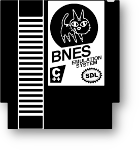
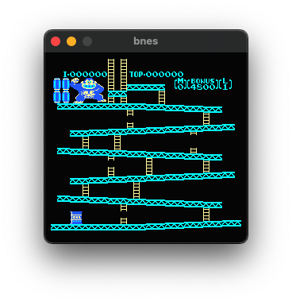
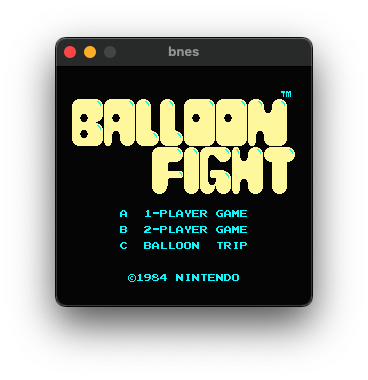

<p style="margin-bottom: 0px;" align="center">
	
</p>

# bnes - Nintendo Entertainment System written in C++20

A work in progress implementation of the **Nintendo Entertainment System (NES)** that leverages the [SDL library](https://www.libsdl.org/) for handling graphics.

I've been writing this emulator not only to learn more about computer architecture, but also to understand the inner-workings of one of my favorite childhood game consoles. What inspired me to move forward with this project is [this video](https://youtu.be/y71lli8MS8s), posted by [bisqwit](https://github.com/bisqwit).

## Disclaimer

While emulation is legal, *the act of downloading ROMs not explicitly licensed for free distribution by the respective copyright holders constitutes as piracy, and is therefore illegal.* 

If you plan to emulate a copyrighted game, you will need to dump the ROM from a copy you personally own (there are plenty of resources on how to do this online). Furthermore, you will be responsible for not distrubuting these ROMs to anybody else.

Alternatively, there are a variety of free, legal ROMs openly available for download. Albeit not games, you can find a selection of ROMs [here](https://www.nesdev.org/wiki/Emulator_tests) that allow you to test your NES emulator. There are plenty of options available, and I recommend scowering the web to discover more.

## A brief history

For those unfamiliar, the [Nintendo Entertainment System (NES)](https://en.wikipedia.org/wiki/Nintendo_Entertainment_System) was a landmark console in the history of video games. It introduced us to household franchises such as [Super Mario Brothers](https://en.wikipedia.org/wiki/Super_Mario_Bros.), [The Legend of Zelda](https://en.wikipedia.org/wiki/The_Legend_of_Zelda), [Metroid](https://en.wikipedia.org/wiki/Metroid), and [countless others](https://youtu.be/um-GMygsRg4).

Initially launched in Japan in 1983 as the Family Computer (colloquially known as the Famicom), the platform found immediate success amongst Japanese consumers, selling 500,000 units within the first two months of its debut. The NTSC/PAL iteration of the Famicom, the NES, wouldn't arrive until 1985 as the west was skeptical of video games following the [video game crash of 1983](https://en.wikipedia.org/wiki/Video_game_crash_of_1983). Their concerns were quickly alleviated by Nintendo's clever engineering and strict quality guidelines for games.

## Inside the NES (WIP)

Discounting the Famicom's inclusion of additional sound channels and oscillators, the hardware inside the Famicom and NES remains largely the same.

The NES uses the [Ricoh 2A03](https://en.wikipedia.org/wiki/Ricoh_2A03) 8-bit microprocessor for handling instructions (*note: European consoles used the 2A07, modified only to comply with the 50 Hz vertical refresh rate standard)*. It contains the famous [MOS Technology 6502](https://en.wikipedia.org/wiki/MOS_Technology_6502) core (which can be found in other famous devices such as the [Apple II](https://en.wikipedia.org/wiki/Apple_II), [Comodore 64](https://en.wikipedia.org/wiki/Commodore_64), and even the [Atari 2600](https://en.wikipedia.org/wiki/Atari_2600)), modified only to disable binary-decimal encodings. Additionally, the 2A03 included the ability to program sounds, poll controllers, and utilize direct memory access. While more powerful, 16-bit processors existed during the NES's development, Nintendo opted to stick with the 2A03 to cut down on costs (a recurring theme with the system). Albeit slower, the 2A03's instruction set being effectively identical to 6502 meant many developers could easily transition to writing games for the platform. Additionally, I was able to find ample documentation when implementing these instructions given the 6502's popularity.

For graphics, Nintendo would also employ Ricoh to create a chipset designed exclusively for the NES. The [Picture Processing Unit (PPU)](https://en.wikipedia.org/wiki/Picture_Processing_Unit) was considered highly advanced at its time of conception, and surpassed the quality of graphics that many arcade machines of the time were capable of producing.

There are *many* hardware details I can't cover in this section for brevity's sake. To learn more, I recommend reading [this document](https://www.nesdev.com/NESDoc.pdf) (hosted by NESDev) as it's immensely detailed.

## What's completed?

- **CPU** - Implemented all official 6502 opcodes and tested them with [nestest](https://github.com/christopherpow/nes-test-roms/blob/master/other/nestest.txt).
- **PPU*** - *Very* rough implementation. It currently produce some graphics, but will need an overhaul to proceed.
- **Cartridges** - Loads [INES 2.0](https://www.nesdev.org/wiki/INES) format ROMs, allocates memory accordingly.
- **Mappers** - Implemented [mapper 0 (NROM)](https://www.nesdev.org/wiki/NROM).
- **GUI** - Currently outputs display buffer using SDL. The user can adjust scaling using a hardcoded variable found in the GUI header file.

## What's next?

- **CPU** - Implement unofficial opcodes to support a variety of non-licensed games.
- **PPU** - Reimplement the PPU to be both compatible and cycle-accurate.
- **Mappers** - Implement mappers 1-5 to support a wider variety of titles.
- **GUI** - Build an interface for loading ROMs and adjusting settings, ditching the terminal.
- **APU** - An afterthought at the moment, albeit sound makes half the experience. I would love to implement it down the road!
- **Documentation** - Document what I've learned from building this emulator for others to reference.

## Screenshots

<p style="margin-bottom: 0px;" align="center">
	
	
</p>

## How to Build

Requirements:

- A compiler that supports C++20
- [CMake](https://cmake.org/) 3.23 (or higher)
- [SDL2](https://www.libsdl.org/) library

Once these requirements are met, the build/compilation process should be straight-forward:

```
$ git clone https://github.com/infophysix/bnes
$ cd bnes/
$ mkdir build/ && cd build/
$ cmake ../
$ make
```

## Usage

Please note the limitations mentioned above.

```
$ ./bnes /path/to/ROM.nes
```

## References

- [Technical Specifications](https://en.wikipedia.org/wiki/Nintendo_Entertainment_System#Technical_specifications)
- [NESdev Wiki](https://www.nesdev.org/wiki/Nesdev_Wiki)
- [6502 Instruction Set](https://www.masswerk.at/6502/6502_instruction_set.html)
- [Writing NES Emulator in Rust](https://bugzmanov.github.io/nes_ebook/index.html)

## Credits

- [Libruh](https://github.com/Libruh) for designing the bnes logo!
